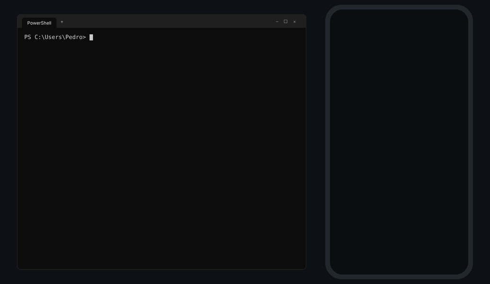
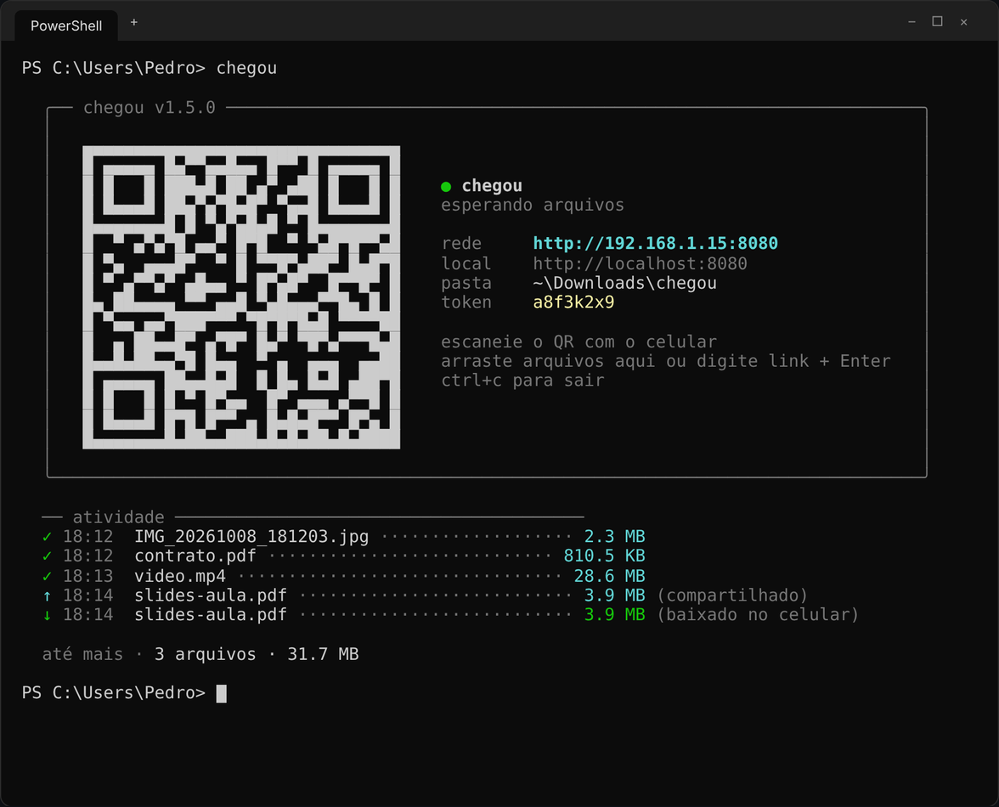
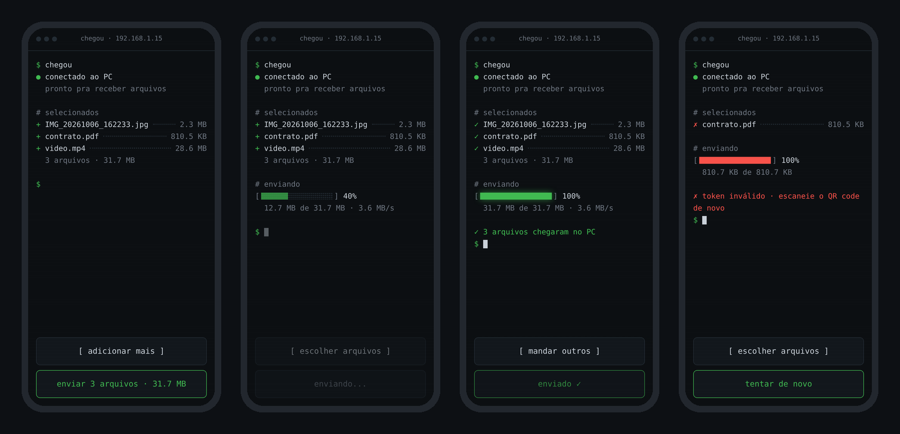

<div align="center">



<br><br>

**arquivos entre o celular e o PC pela rede local. um comando, um QR code, pronto.**


</div>

---

## ▸ como funciona

<div align="center">



</div>

1. rode `chegou` no PC
2. escaneie o QR code com o celular
3. escolha arquivos, tire fotos ou grave vídeos
4. tudo cai direto na pasta do PC

sem app, sem conta, sem internet. só precisa estar na mesma rede.

---

## ▸ telas

**no PC**



**no celular**: escolhendo, enviando, concluído e erro



---

## ▸ instalação

```bash
npm install -g chegou
```

ou sem instalar nada:

```bash
npx chegou
```

---

## ▸ uso

```bash
chegou                      # receber arquivos do celular
chegou foto.png video.mp4   # disponibiliza arquivos pro celular baixar
chegou https://youtube.com  # manda um link ou texto pro celular
chegou --dir ./recebidos    # escolhe onde salvar
chegou --port 3000          # escolhe a porta
chegou --timeout 10         # desliga sozinho depois de 10 min sem uso
```

> **dica:** com o `chegou` rodando no terminal, basta **arrastar qualquer arquivo** pra janela dele ou digitar um texto/link e apertar Enter. O celular recebe na hora!

---

## ▸ segurança

- cada sessão gera um **token aleatório** que vai dentro do QR code
- quem só souber o IP não consegue enviar nada
- nomes de arquivo são sanitizados e nada é sobrescrito
- o tráfego é HTTP na rede local: use em redes que você confia
- com `--timeout`, o servidor desliga sozinho se ficar parado (útil se você esquecer ele aberto)

---

## ▸ problemas comuns

**o celular não abre a página**
o firewall do Windows pode bloquear na primeira vez. clique em *permitir acesso* quando ele perguntar.

**funciona em casa mas não na faculdade/café**
redes públicas costumam isolar os dispositivos entre si. não tem como contornar.

---

## ▸ stack

```
node.js · fastify · html/css/js puro
```

---

<div align="center">

MIT © Pedro Randolfo

</div>
