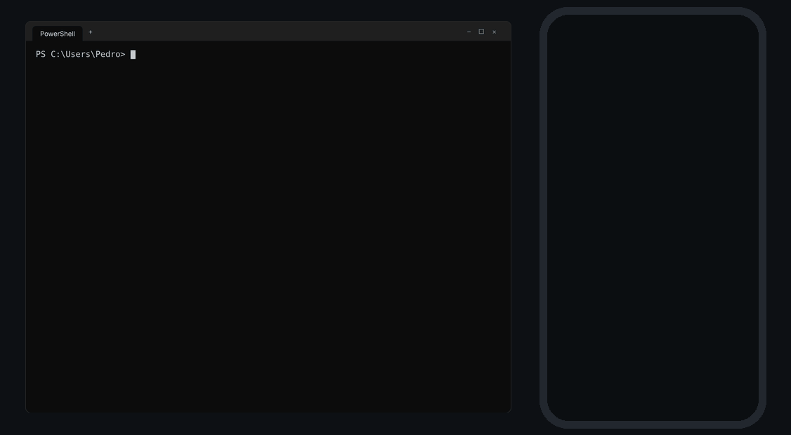
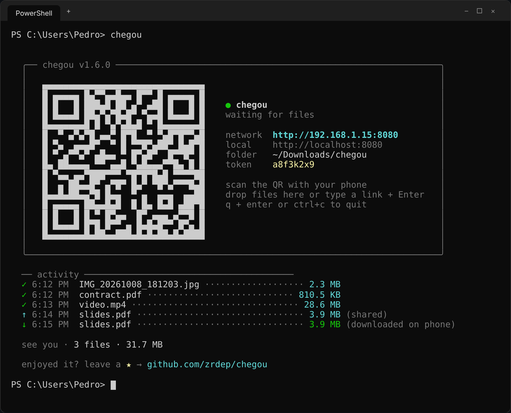
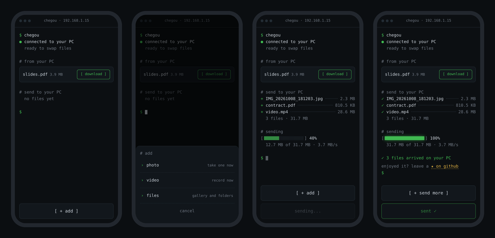

<div align="center">

**English** · [Português](README.pt-BR.md)



<br><br>

**move files between your phone and your PC over the local network. one command, one QR code, done.**

<br>


</div>

<br>

```
› receive     photos, videos and files from your phone, straight into a PC folder
› send        files, text and links from your PC to your phone
› camera      take a photo or record a video and it lands on your PC
› drop        drop a file or folder on the terminal and it shows up on the phone
› safe        a token inside the QR: only whoever scanned it gets in
› disposable  nothing to install on the phone, nothing running after ctrl+c
```

> *chegou* (sheh-GOH) is Portuguese for *"it arrived"*.

---

## ▸ how it works

<div align="center">



</div>

1. run `npx chegou` on your PC
2. scan the QR code with your phone
3. send whatever you want, both ways

no app, no account, no internet. both devices just need to be on the same network.

---

## ▸ install

without installing anything:

```bash
npx chegou
```

or for good:

```bash
npm install -g chegou
```

requires **Node.js 20** or newer.

---

## ▸ usage

```bash
chegou                        # open and wait for files from your phone
chegou photo.png video.mp4    # make these files ready to download on the phone
chegou ./photos               # every file in a folder
chegou https://youtube.com    # send a link or some text to the phone
chegou --timeout 10           # shut down after 10 min without use
chegou --relay                # use the tunnel: works from any network
chegou --local                # use the local network without asking
chegou --lang pt              # terminal in Portuguese
```

when it starts, chegou asks how your phone will connect (arrow keys + Enter, or `1`/`2`):

```
  how will your phone connect?

  › 1  local   same wi-fi · faster · no size limit
    2  tunnel  any network · via Cloudflare · up to 100 MB per file
```

pass `--local` or `--relay` to skip the question.

while chegou is running, **drop files or folders on the terminal window** or type some text/a link and press Enter: the phone gets it right away.

### options

| option | short | what it does | default |
|---|---|---|---|
| `--relay` | `-r` | use the Cloudflare tunnel, works from any network (or `--tunnel`) | ask |
| `--local` | `-l` | use the local network, don't ask | ask |
| `--port <number>` | `-p` | preferred port (if it's busy, the next free one is used) | `8080` |
| `--dir <path>` | `-d` | where to save what comes from the phone | `~/Downloads/chegou` |
| `--timeout <min>` | `-t` | shut down after X minutes without use (`0.5` = 30 s) | off |
| `--lang <language>` | | terminal language (`en`, `pt`) | system's |
| `--help` | `-h` | show the help | |

---

## ▸ local network or tunnel?

| | local network | tunnel |
|---|---|---|
| when | PC and phone on the same wi-fi | different networks, mobile data, campus/café wi-fi |
| speed | your network's (fast) | depends on both internet connections |
| limit | none | 100 MB per file (Cloudflare's limit) |
| path | only your network | Cloudflare's servers, over HTTPS |

the tunnel uses [Cloudflare Quick Tunnels](https://try.cloudflare.com) (free, no account). the first time, chegou downloads `cloudflared` (~30 MB); after that it opens instantly. the address is random and the token is longer, since the url is public.

---

## ▸ screens

**on the PC**



**on the phone**: start, add menu, sending and done



---

## ▸ security

- every session creates a **random token** that goes inside the QR code; knowing only the IP gets you a `401`
- the token is checked **before** a single byte of the file is accepted
- file names are sanitized (no `../../`) and nothing is overwritten: `photo.jpg` becomes `photo (1).jpg`
- with `--timeout`, the server shuts itself down if you forget it open
- on the local network, traffic is plain **HTTP**: use it on networks you trust
- on the tunnel, traffic is **HTTPS**, but it goes through Cloudflare's servers

---

## ▸ FAQ

<details>
<summary><b>why not just use LocalSend?</b></summary>
<br>

LocalSend is great and more complete (encryption, works between any devices). chegou is different in how you use it:

- **nothing to install on the phone**: scan the QR and it opens in the browser. handy when it's not your phone
- **it's a command**: `npx chegou`, send what you need, `ctrl+c`. nothing keeps running in the background
- **it lives in the terminal**: drop files on the window and use it in your dev workflow

if you move files between your own devices every day, LocalSend is probably the better pick. chegou is for "I need this file over there now, and I'm already in the terminal".

</details>

<details>
<summary><b>is it safe to run <code>npx</code>?</b></summary>
<br>

being careful is healthy: running random npm packages is a real risk. that's why chegou is small and open: a handful of files in `bin/`, `src/` and `public/`, readable in a few minutes. the only dependencies are `fastify` (and official plugins), `picocolors`, `qrcode-terminal` and `untun` (for the tunnel).

what it does on your PC: opens a port on the local network while it runs and writes files only to the folder you choose. it installs nothing and doesn't run in the background. it only reaches the internet if you pick the tunnel.

prefer running it from source:

```bash
git clone https://github.com/zrdep/chegou
cd chegou && npm install && node bin/chegou.js
```

</details>

<details>
<summary><b>the phone can't open the page</b></summary>
<br>

- make sure the PC and the phone are **on the same wi-fi** (turning off mobile data helps)
- on Windows, the **firewall** asks the first time: check *private networks* and allow it
- check that the IP in the terminal matches your wi-fi adapter in `ipconfig`

</details>

<details>
<summary><b>works at home but not on campus/at a café</b></summary>
<br>

public networks usually isolate devices from each other (AP isolation). use the **tunnel** for that:

```bash
chegou --relay
```

or pick **tunnel** when chegou asks. it creates a public address through Cloudflare, so it works even with the PC on campus wi-fi and the phone on mobile data. the limit is 100 MB per file.

</details>

---

## ▸ languages

chegou speaks **English** and **Portuguese**. the terminal follows your system language and the phone page follows the phone's, each on its own. to force one: `--lang en` in the terminal or `?lang=en` in the phone's url.

want to add a language? it's two files:

```
src/i18n/en.js       → terminal texts
public/i18n/en.js    → phone page texts
```

copy both using the language code (e.g. `es.js`), translate, register them in `src/i18n/index.js` and `public/index.html`, and open a PR.

---

## ▸ code

```
bin/chegou.js          command entry point
src/
  main.js              the flow: options → network → server → tunnel → banner
  config.js            fixed numbers (port, limits, token size)
  cli/                 everything terminal: options, question, banner, --timeout
  server/              server: upload, download, sharing, token
  net/                 network: IP, free port, Cloudflare tunnel
  i18n/                terminal texts (en, pt)
public/
  index.html, app.js   the phone page
  i18n/                page texts (en, pt)
```

---

## ▸ stack

```
node.js · fastify · plain html/css/js
```

---

<div align="center">

made by [Pedro Randolfo](https://github.com/zrdep) · MIT

if it helped you, leave a ⭐

</div>
