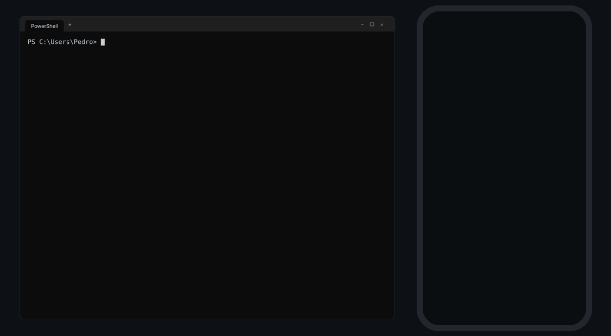
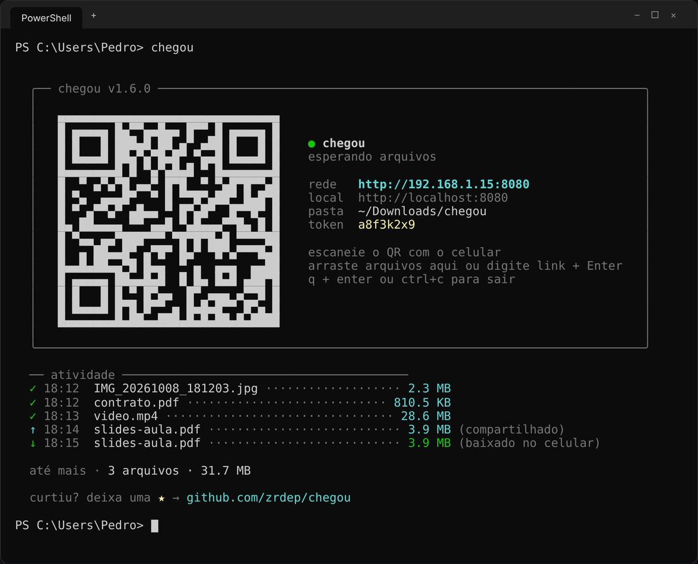
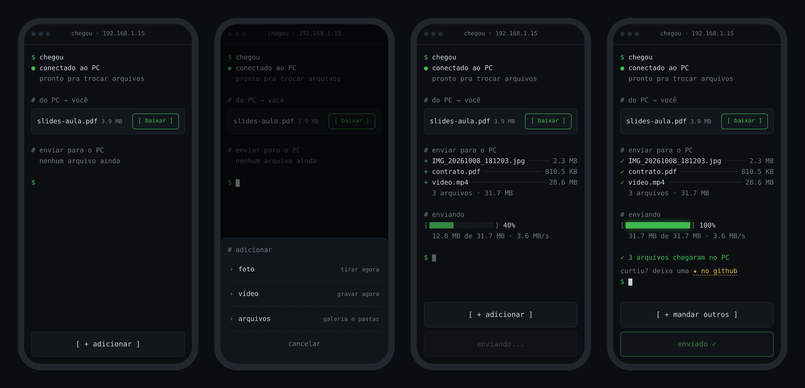

<div align="center">

[English](README.md) · **Português**



<br><br>

**arquivos entre o celular e o PC pela rede local. um comando, um QR code, pronto.**

<br>


</div>

<br>

```
› receber      fotos, vídeos e arquivos do celular direto numa pasta do PC
› enviar       arquivos, textos e links do PC pro celular
› câmera       tira a foto ou grava o vídeo e ele já cai no PC
› arrastar     solte um arquivo na janela do terminal e ele aparece no celular
› seguro       token no QR: só quem escaneou consegue entrar
› descartável  nada instalado no celular, nada rodando depois do ctrl+c
```

---

## ▸ como funciona

<div align="center">



</div>

1. rode `npx chegou` no PC
2. escaneie o QR code com o celular
3. mande o que quiser, pros dois lados

sem app, sem conta, sem internet. só precisa estar na mesma rede.

---

## ▸ instalação

sem instalar nada:

```bash
npx chegou
```

ou de vez:

```bash
npm install -g chegou
```

precisa de **Node.js 20** ou mais novo.

---

## ▸ uso

```bash
chegou                        # abre e espera arquivos do celular
chegou foto.png video.mp4     # deixa esses arquivos prontos pro celular baixar
chegou ./fotos                # todos os arquivos de uma pasta
chegou https://youtube.com    # manda um link ou texto pro celular
chegou --timeout 10           # desliga sozinho depois de 10 min sem uso
chegou --relay                # usa o túnel: funciona de qualquer rede
chegou --local                # usa a rede local sem perguntar
chegou --lang en              # terminal em inglês
```

ao abrir, o chegou pergunta como o celular vai se conectar (setas + Enter, ou `1`/`2`):

```
  como o celular vai se conectar?

  › 1  rede local  mesmo wi-fi · mais rápido · sem limite
    2  túnel       qualquer rede · via Cloudflare · até 100 MB por arquivo
```

passando `--local` ou `--relay`, ele pula a pergunta.

com o chegou aberto, **arraste arquivos ou pastas pra janela do terminal** ou digite um texto/link e aperte Enter: o celular recebe na hora.

### opções

| opção | atalho | o que faz | padrão |
|---|---|---|---|
| `--relay` | `-r` | usa o túnel Cloudflare, funciona de qualquer rede (ou `--tunnel`) | pergunta |
| `--local` | `-l` | usa a rede local, sem perguntar | pergunta |
| `--port <número>` | `-p` | porta preferida (se estiver ocupada, usa a próxima livre) | `8080` |
| `--dir <caminho>` | `-d` | onde salvar o que chega do celular | `~/Downloads/chegou` |
| `--timeout <min>` | `-t` | desliga depois de X minutos sem uso (aceita `0.5` = 30 s) | desligado |
| `--lang <idioma>` | | idioma do terminal (`pt`, `en`) | o do sistema |
| `--help` | `-h` | mostra a ajuda | |

---

## ▸ rede local ou túnel?

| | rede local | túnel |
|---|---|---|
| quando usar | PC e celular no mesmo wi-fi | redes diferentes, 4G, wi-fi de faculdade/café |
| velocidade | a da sua rede (rápido) | depende da internet dos dois lados |
| limite | nenhum | 100 MB por arquivo (limite do Cloudflare) |
| por onde passa | só pela sua rede | pelos servidores do Cloudflare, com HTTPS |

no túnel, o chegou usa os [Quick Tunnels do Cloudflare](https://try.cloudflare.com) (gratuitos, sem conta). na primeira vez ele baixa o `cloudflared` (~30 MB), depois abre na hora. o endereço é aleatório e o token fica mais longo, já que a url é pública.

---

## ▸ telas

**no PC**



**no celular**: início, menu adicionar, enviando e concluído



---

## ▸ segurança

- cada sessão gera um **token aleatório** que vai dentro do QR code; quem só souber o IP leva `401`
- o token é checado **antes** de receber qualquer byte do arquivo
- nomes de arquivo são limpos (nada de `../../`) e nada é sobrescrito: `foto.jpg` vira `foto (1).jpg`
- com `--timeout`, o servidor desliga sozinho se você esquecer ele aberto
- na rede local o tráfego é **HTTP**, sem criptografia: use em redes que você confia
- no túnel o tráfego é **HTTPS**, mas passa pelos servidores do Cloudflare

---

## ▸ perguntas frequentes

<details>
<summary><b>por que não usar o LocalSend?</b></summary>
<br>

o LocalSend é ótimo e mais completo (tem criptografia e funciona entre qualquer aparelho). a diferença do chegou é o jeito de usar:

- **nada pra instalar no celular**: escaneia o QR e abre no navegador. ajuda quando o celular não é seu
- **é um comando**: `npx chegou`, manda o que precisa e `ctrl+c`. nada fica rodando em segundo plano
- **mora no terminal**: dá pra arrastar arquivo na janela e usar dentro dos seus fluxos de dev

se você transfere arquivo todo dia entre os seus aparelhos, o LocalSend provavelmente é a melhor escolha. o chegou é pro "preciso passar isso agora e já tô no terminal".

</details>

<details>
<summary><b>é seguro rodar <code>npx</code>?</b></summary>
<br>

desconfiar é saudável: rodar pacote aleatório do npm é um risco real. por isso o chegou é pequeno e aberto: poucos arquivos em `bin/`, `src/` e `public/`, dá pra ler tudo em minutos. as dependências são só `fastify` (e plugins oficiais), `picocolors`, `qrcode-terminal` e `untun` (pro túnel).

o que ele faz no seu PC: abre uma porta na rede local enquanto está rodando e grava arquivos só na pasta que você escolher. não instala nada e não roda em segundo plano. só acessa a internet se você escolher o modo túnel.

se preferir rodar direto do código:

```bash
git clone https://github.com/zrdep/chegou
cd chegou && npm install && node bin/chegou.js
```

</details>

<details>
<summary><b>o celular não abre a página</b></summary>
<br>

- confira se o PC e o celular estão **no mesmo Wi-Fi** (desligar os dados móveis ajuda)
- no Windows, o **firewall** pergunta na primeira vez: marque *redes privadas* e permita
- confira se o IP do terminal é o mesmo do adaptador Wi-Fi no `ipconfig`

</details>

<details>
<summary><b>funciona em casa mas não na faculdade/café</b></summary>
<br>

redes públicas costumam isolar os aparelhos entre si (AP isolation). para esses casos, use o **modo relay**:

```bash
chegou --relay
```

ou escolha **túnel** quando o chegou perguntar. ele cria um endereço público via Cloudflare, então funciona mesmo com o PC no wi-fi da faculdade e o celular no 4G. o limite é 100 MB por arquivo.

</details>

---

## ▸ idiomas

o chegou fala **português** e **inglês**. o terminal segue o idioma do sistema e a página segue o idioma do celular, cada um no seu. pra forçar: `--lang en` no terminal ou `?lang=en` na url do celular.

quer traduzir pra outro idioma? são dois arquivos:

```
src/i18n/en.js       → textos do terminal
public/i18n/en.js    → textos da página do celular
```

copie os dois com o código do idioma (ex: `es.js`), traduza, registre em `src/i18n/index.js` e no `public/index.html`, e mande um PR.

---

## ▸ código

```
bin/chegou.js          entrada do comando
src/
  main.js              o fluxo: opções → rede → servidor → túnel → banner
  config.js            números fixos (porta, limites, tamanho do token)
  cli/                 tudo do terminal: opções, pergunta, banner, --timeout
  server/              servidor: upload, download, compartilhar, token
  net/                 rede: IP, porta livre, túnel Cloudflare
  i18n/                textos do terminal (pt, en)
public/
  index.html, app.js   a página do celular
  i18n/                textos da página (pt, en)
```

---

## ▸ stack

```
node.js · fastify · html/css/js puro
```

---

<div align="center">

feito por [Pedro Randolfo](https://github.com/zrdep) · MIT

se te ajudou, deixa uma ⭐

</div>
